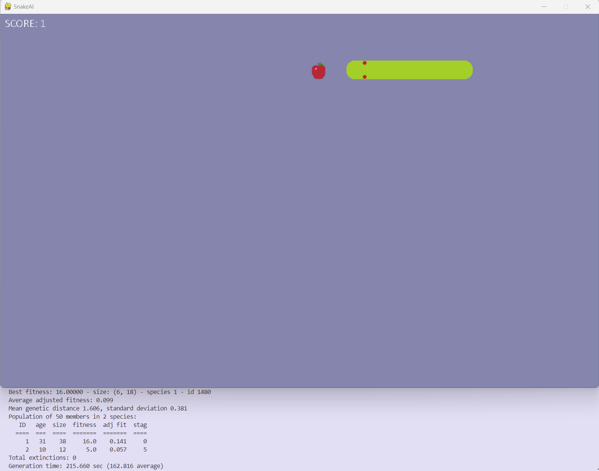

# Neat Snake

An AI that plays Snake game using NEAT (NeuroEvolution of Augmenting Topologies) Python library.

The Snake game was made using Pygame and the assets where created using Aseprite.



## Running

**To run the program**

1. Navigate to the 'snake-ai' folder

    ```cd snake-ai```

<br>

2. Execute the main script

    ```python main.py```

<br>

**If you want to play the game on your own:**

1. Navigate to the 'snake-ai' folder 

    ```cd playable_snake```

<br>

2. Execute the main script

    ```python main.py```

### Notes

This project is still work in progress. There are many things to improve upon.